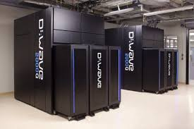
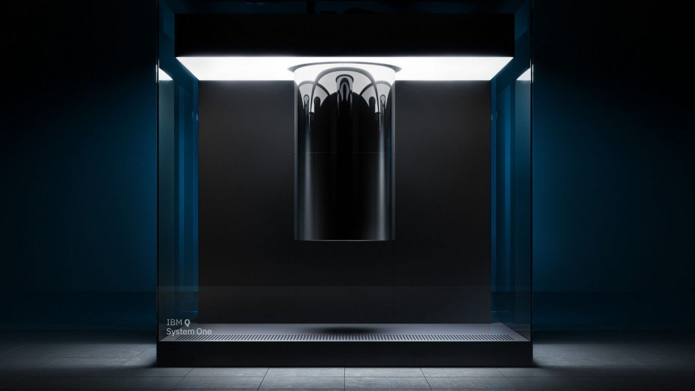
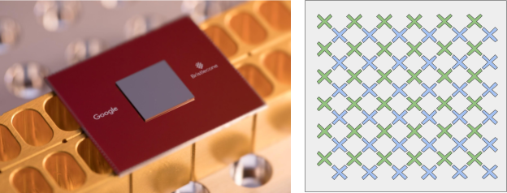
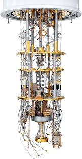
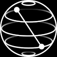

<h1 align="center">Uma Breve História da Computação Quântica</h1>
<h4 align="center">João Gabriel Segato Kruse</h4>

## Resumo

Neste texto veremos os acontecimentos que levaram ao surgimento da computação quântica. Seguiremos dando uma olhada no estado da arte quanto a computadores quânticos, e os problemas que ainda estamos enfrentando. Por fim, passaremos por cima do que podemos esperar da área para o futuro.

## Computação Clássica

Embora a computação tenha uma origem muito mais antiga, passando pelo ábaco, Tear de Jacquard e desenvolvimentos teóricos de pessoas como Charles Babbage e Ada Lovelace além de descobertas nas áreas da matemática e da física, vamos começar o nossa análise em 1936, com um artigo publicado pelo matemático Alan Turing. Nesse artigo, Turing inicia a computação moderna ao conceber a Máquina de Turing, um modelo abstrato que representa os aspectos lógicos de um computador. Com isso, nos anos nos anos subsequêntes as primeiras implementações físicas de computadores de propósito geral se deram com projetos como o ENIAC (1946) e UNIVAC I, líderados pelo também matemático John von Neumann, ainda usando válvulas. Para o desenvolvimento dessas máquinas, outros conceitos usados até hoje foram criados, como o da arquitetura von Neumann, na qual o código a ser executado é armazenado na mesma memória que os dados, ao invés de ter uma memória separada. Ao mesmo tempo em que esses computadores estavam sendo desenvolvidos, em 1948 Claude Shannon fundamentou a teoria da informação clássica, desenvolvendo 2 teoremas fundamentais: o teorema de codificação em canais sem ruído, que descreve os requisitos físicos necessários para armazenar a saída de uma fonte de informação; e o teorema de codificação em canais com ruído, quantificando quanta informação pode ser enviada com confiança por um canal com ruído. Além disso, Shannon demonstrou a eficácia da utilização de Códigos de Correção de Erros para proteger a informação enviada em canais ruidosos. Avançando um pouco no tempo, no final da década de 1950, as válvulas foram substituídas por transistores (que haviam sido criados em 1947, mas demoraram um tempo até se tornarem utilizáveis nos computadores), o que foi uma grande revolução na área, já que transistores apresentavam diversas vantagens com relação às vávulas, como o fato de não queimarem tão facilmente, além de serem mais rápidos e menores. Ademais, foi durante essa década que as primeiras linguagens de programação (como o Fortran) foram desenvolvidas. A partir do final da década de 1960 os computadores passam a ser construídos com circuitos integrados, reduzindo ainda mais o seu tamanho e melhorando o desempenho, de modo que Gordon Moore em 1965 preve que o número de componentes em um circuito integrado dobraria a cada ano, uma projeção que veio a ser chamada de Lei de Moore e que mais tarde se provaria válida até a atualidade. Seguindo mais no tempo, microprocessadores surgiram e foram evoluindo e com eles novas linguagens de programação também foram sendo desenvolvidas até chegarmos nos dias de hoje.
Indo um pouco mais a fundo, a computação clássica usa como unidade básica os bits, que podem possuir o valor 1 ou 0. A partir deles é possível representar qualquer informação utilizando a representação binária, e através de portas lógicas como o AND, NOT, OR, etc, é possível manipular esses dados para realizar operações aritméticas, por exemplo. Subindo um nível em uma escala de abstração, podemos esquecer um pouco da implementação do hardware e nos preocuparmos apenas com algorítmos, que são como soluções passo a passo para problemas, recebendo entradas, manipulando dados e resultando em saídas que  resolvam as tarefas designadas. Atualmente, esses algoritmos podem ser programados em diversas linguagens de programação, como Python, C, Java, etc. Por fim, vemos que a teoria da computação possui diversos ramos de estudo, como a análise da complexidade de algoritmos, por exemplo, na qual é investigado o custo computacional (em tempo e memória necessários) para a implementação de algoritmos. Dentro dessa área, classes de complexidade são definidas por fatores como o tipo de problema, os recursos limitantes e o modelo de computação, e são usadas para agrupar conjuntos de problemas relacionados. Duas classes muito importantes são a P e a NP, a primeira contendo problemas que possuem uma solução eficiente (polinomiais) e a segunda contendo problemas para os quais não existem algoritmos conhecidos para resolvê-los de forma eficiente, e uma das questões abertas mais importantes na área de ciência de computação é saber se P e NP são iguais.

## Mecânica Quântica
No mundo da física, nossos conhecimentos e teorias estão sempre diretamente relacionados com as nossas observações do Universo, mas essas são sempre limitadas pelos nossos aparelhos de medição. Com isso, conforme nossos aparelhos e conhecimentos evoluem e medições mais precisas e em diferentes escalas podem ser realizadas, novas teorias surgem ou são invalidadas, a exemplo da mecânica Newtoniana, que foi tida como verdade durante vários séculos. Na nossa escala de massa e tamanho, a teoria da gravidade de Newton descreve com incrível acurácia as forças exercidas sobre os corpos, inclusive permitindo entender as órbitas planetárias. Porém conforme nossas medições foram ficando mais precisas, mais discrepâncias quanto a essa teoria foram sendo encontradas, especialmente quando se tratando de objetos se movendo em altas velocidades ou com grandes massas (como o caso dos erros na previsão da órbita de Mercúrio), culminando na Teoria da Relatividade de Einstein na década de 1910. Essa teoria revolucionou a física da época e, com apenas leves adaptações, é ainda acreditada e validada até hoje. Mas enquanto a Relatividade Geral mudava a forma de entendermos o Universo em escalas planetárias, outra revolução na física também estava ocorrendo no início do século 20, só que dessa vez em escalas microscópicas. Predições decorrentes das teorias físicas da época não conseguiam prever adequadamente o comportamento de partículas atômicas, apresentando resultados absurdos como elétrons espiralando em direção ao núcleo de seus respectivos átomos e a catástrofe ultravioleta envolvendo energias infinitas. Para resolver esses problemas um novo modelo físico teve de ser desenvolvido para descrever o Universo na escala atômica: a Mecânica Quântica.  
A mecânica quântica, no entanto, não surgiu do nada, mas sim foi resultado de diversas descobertas ao longo das décadas antecedentes. Em 1900 Max Planck apresentou uma teoria de que a energia seria quantizada para justificar os resultados obtidos ao estudar a radiação de corpos escuros, e em 1905 Einstein propôs também que a luz não seria apenas uma onda, mas que teria também propriedades corpusculares, apresentando a ideia de um quanta de luz (que viria a ser chamado de fóton) ao estudar o efeito fotoelétrico. Além disso, outras teorias sobre o átomo desenvolvidas por Rutherford e Bohr também trouxeram ideias novas para a área e o princípio de exclusão de Pauli em 1925 também foi importante para isso. Com isso, chegamos em alguns dos conceitos e equações fundamentais da mecânica quântica moderna: a dualidade onda partícula, o princípio da incerteza, a função de onda e a equação de onda de Schrödinger. A dualidade onda partícula foi apresentada por de Broglie em 1924, e fala que todo corpo apresenta características de onda e de partícula, sendo impossível descrever o seu comportamento através de apenas uma ou outra definição. O princípio da incerteza de Heisenberg diz que a posição e o momento de uma partícula não podem ser medidos simultaneamente com precisão arbitrária, mas sim que a multiplicação de suas respectivas incertezas deve ser obrigatoriamente maior que uma constante. A função de onda é uma equação que descreve o estado de partículas atômicas. Por fim, a equação de Scrödinger descreve o comportamento de um estado quântico ao longo do tempo, permitindo a análise de sua evolução temporal.
Analisar o nome da área em mais detalhes também nos ajuda a entender de que ela se trata. A palavra "Mecânica" está relacionada ao comportamento e ao movimento de algo, enquanto que a palavra "Quântica" descreve uma quantidade discreta de algo (podemos pensar, a título de exemplo, no oceano e em como ele, mesmo parecendo uma massa única, na verdade é formado por inúmeras moléculas de água, ou seja, podemos ver a molécula de água como um quantum do oceano). Dessa forma, mecânica quântica é o movimento e interação das partes discretas de algo, e geralmente para vermos os efeitos mais conhecidos dela precisamos estar trabalhando com objetos na escala atômica. Nessa escala microscópica, a função de onda é o que descreve o estado de um sistema de partículas e se elevarmos essa função ao quadrado encontramos a probabilidade da partícula estar em um determinado local (a partícula na verdade se encontra simultaneamente em todas as posições que apresentam uma probabilidade > 0 na função de onda). Pode parecer contra-intuitivo pensar em partículas como ondas e sem um local definido, mas se pensarmos na teoria de de Broglie isso faz mais sentido. Mas então como é possível que tenhamos aparelhos que detectam elétrons e indicam apenas uma posição para ele, por exemplo, se eles não possuem uma posição definida? O que acontece é que, no momento da medição, a localização da partícula é determinada, e dizemos que a função de onda colapsou para um dos possíveis locais descritos por ela. Recomendo que assistam esse vídeo do Dr. Don Lincoln, do Fermilab, no qual ele explica e exemplifica esses conceitos em mais detalhes (<https://www.youtube.com/watch?v=K0VY9_hB_WU>). Uma coisa importante de se ressaltar nesse assunto é que devemos evitar pensar no estado da partícula como escondido dentro de uma caixa e sendo descoberto quando observamos ela. Esse pensamento é errado pois ele assume que o estado está predefinido, nós apenas não conseguimos determiná-lo até a medição, o que não é verdade. O que ocorre é que a partícula está em todos os estados ao mesmo tempo, e apenas quando medimos ela é que ela "decide" aleatoriamente em função das probabilidades descritas pela função de onda para qual estado ela vai colapsar.
Com esses conhecimentos, podemos dizer agora que mecânica quântica é um framework matemático para a criação de teorias físicas, como a QED (Eletrodinâmica Quântica), por exemplo, que descreve a interação entre átomos e luz. Além disso, embora as descrições da Mecânica Quântica pareçam atuar apenas para coisas muito pequenas, seus efeitos podem ser observados em corpos macroscópicos como a superfluidez e a supercondutividade. Com isso, vemos que a Mecânica Quântica é uma ferramenta muito poderosa para entendermos o Universo que nos cerca. 

## Computação Quântica

Embora os efeitos da mecânica quântica já fossem conhecidos no início do século 20, não foi até a década de 1970 que as áreas de computação e informação quântica começassem a se desenvolver, guiadas pelos avanços no controle de estados quânticos únicos (até então o controle de estados quânticos era apenas dado em blocos contendo diversos sistemas quânticos, de forma que não havia um controle direto deles). A partir disso, várias descobertas na área foram surgindo, como o famoso algoritmo de Shor, criado por Peter Shor em 1994; o surgimento de códigos de correção quânticos em 1995 e os critérios de di Vicenzo, que apresentam 5 requisitos mínimos para a criação de um computador quântico em 1996. Desde então a área vem evoluindo em ritmo acelerado até os dias de hoje. Quando tratamos de sistemas clássicos estamos sempre lidando com sistemas determinísticos, ou seja, sistemas nos quais não há nenhuma aleatoriedade envolvida na sua evolução, de modo que condições iniciais idênticas implicam resultados idênticos. A ideia por trás da computação e informação quântica, no entanto, é utilizar-se das propriedades da mecânica quântica de superposição (estar em múltiplos estados simultaneamente), entrelaçamento (forma como partículas podem atuar conjuntamente de formas que não podem ser explicadas usando lógica clássica) e interferência (similar à interferência entre ondas) para realizar computações de forma não determinística. Da mesma forma que a computação clássica, ela já possui aplicações em diversas áreas, desde finanças e problemas de otimização, até simulações químicas e ajudam no próprio estudo de fenômenos quânticos.

## Computadores Quânticos Atuais

Embora possa parecer uma coisa apenas para um futuro distante, computadores quânticos já existem no mundo hoje e estão em um ritmo de desenvolvimento acelerado. Já no ano de 1992, Isaac Chuang, Neil Gershenfeld e Mark Kubinec criaram o primeiro computador quântico que podia receber dados de entrada e resultar em uma saida, contendo apenas 2 qubits e usando métodos ainda rudimentares. A partir daí, novas tecnologias para a redução de ruído, implementação de qubits, etc foram surgindo e melhorando, como os qubits supercondutores, que são usados na maior parte dos computadores quânticos atuais. Como os sistemas com os quais se trabalha na computação quântica são muito sensíveis, diversas tecnologias devem ser utilizadas para isolar o sistema do exterior, para evitar decoerências e colapsos indesejados dos estados. Uma das ações tomadas para previnir que isso é ocorra é resfriar os computadores quânticos a apenas alguns centiKelvin (o D-Wave 2000Q, por exemplo, é resfriado à 0.015K ou -272.985ᵒC), ou seja, temperaturas inferiores ao vácuo do espaço. Isso é necessário pois a energia resultante de temperaturas mais elevadas é o suficiente para excitar o sistema quântico e acabar com a coerência. Atualmente, diversas empresas estão empenhadas na corrida quântica, como a D-Wave, IBM, Google, Rigetti, para citar algumas. A D-Wave, por exemplo lançou seu primeiro computador quântico em 2011, com 128 qubits, descrito como o "primeiro computador quântico comercial do mundo". Em 2017 eles lançaram um computador com 2000 qubits e estão já planejando o lançamento de sua próxima geração com 5000 qubits. Uma ressalva importante é que os computadores da D-Wave não são de propósito geral, ou seja, eles não conseguem implementar qualquer operação quântica, mas são, nesse caso, especializados em soluções de problemas de otimização (utilizando o método de Quantum Annealing, ou, Recozimento Quântico). 

D-wave 2000Q

A IBM também possui diversos computadores quânticos de propósito geral, com quantidade de qubits variando entre 5 e 53 e lançou seu primeiro computador quântico comercial em 2019, o IBM Q System One, com 20 qubits. Perceba que a quantidade de qubits é muito reduzida em comparação aos modelos da D-Wave pelo fato desses computadores serem de propósito geral.

IBM Q System One

A gigante Google também não está medindo esforços na área, tendo também construído diversos processadores quânticos de propósito geral, tendo como maior o Bristlecone, com 72 qubits.

Chip Quântico Bristlecone

A Rigetti também possui computadores quânticos de propósito geral, sendo o seu maior o Aspen-8, com 32 qubits.

Aspen-8 da Rigetti Computing

Avaliando agora o desempenho dos computadores quânticos atuais, vemos que não podemos dizer ainda que há uma imensa vantagem computacional no uso deles, no entanto estamos caminhando em direção a isso. Em benchmarks realizados pela D-Wave quanto ao seu D-Wave 2000Q por exemplo, foi verificado um tempo de execução de 1000 a 10000x menor em comparação aos melhores algoritmos clássicos executados em servers computacionais dedicados. Embora isso seja uma redução no tempo de execução, não podemos dizer que houve um speedup pois a complexidade dos algoritmos clássico e quântico escalonavam-se na mesma taxa. Já em 2019 a Google havia anunciado ter atingido a "supremacia quântica", ponto em que computadores quânticos conseguem computar coisas impossíveis para computadores clássicos, quando executou uma computação em 200 segundos em um computador quântico que supostamente levaria mais de 10 mil anos para ser resolvida pelo computador clássico mais potente da atualidade (afirmação que foi posta em dúvida pela IBM que argumentou que o problema poderia ser resolvido em 2.5 dias em computadores clássicos). Além disso, em 2020 a Google realizou a primeira simulação química em um computador quântico. Ainda assim, ainda existem muitos pontos que precisam ser melhorados para possibilitar a realização de experimentos mais complexos. Um desses pontos é o erro associado as portas quânticas e as medições, que ainda é muito alto se comparado às portas lógicas clássicas. Outro ponto é o tempo de coerência dos circuitos, ou seja, o tempo para que um estado perca a coerência e, por consequência, perca a informação contida nele, que ainda é baixo na maioria dos computadores atuais, mas vem aumentando significativamente conforme as novas gerações vão sendo lançadas.
Como podemos ver, a computação quântica já é uma realidade, e diversos problemas já podem ser resolvidos em computadores do tipo nos dias de hoje. Mais que isso, já existem diversas formas de interagir e programar computadores quânticos fora do laboratório. Várias empresas como a D-Wave, IBM, etc fornecem serviços de computação quântica na nuvem, permitindo que qualquer um com uma conexão com a internet interaja e programe computadores quânticos e simuladores de casa. Alguns exemplos de linguagens e módulos que permitem isso são: Qiskit, uma SDK open-source que permite interagir tanto com computadores quânticos reais quanto simuladores nos níveis de algoritmos, circuitos e pulsos através de uma bilioteca em Python; Cirq, uma biblioteca em python para escrever, manipular e otimizar circuitos quânticos e executá-los em computadores quânticos reais ou simuladores; além de muitos outros, como Forest/PyQuil, Ocean SDK, Q#, ..., inclusive existindo o OpenQASM (Open Quantum Assembly Language), que é uma representação intermediária para instruções quânticas. Com isso podemos ver que existem diversas ferramentas que possibilitam que qualquer um entre no mundo da computação quântica e desenvolva seus próprios projetos e ajude no desenvolvimento da área.

## Futuro

Como acabamos de ver, a computação quântica ainda tem muito pela frente, mas o que podemos esperar dela para o futuro? Uma das grandes promessas da computação quântica é a solução de problemas impossíveis para um computador clássico, seja devido ao tempo de execução, seja devido aos recursos computacionais necessários. Já existem algoritmos quânticos que comprovadamente resolvem problemas em complexidades menores que os equivalentes clássicos (como o algoritmo de Grover, que resolve em O($\sqrt{n}$) problemas que são O(n) classicamente) e outros para os quais há um ganho com relação aos algoritmos clássicos conhecidos atualmente, embora ainda não haja prova de que não exista um algoritmo clássico de complexidade equivalente (como o algoritmo de Shor para a fatoração de números, que possui uma solução polinomial para um problema sem solução clássica eficiente conhecida). Além disso, análises feitas pela D-Wave quanto ao seu D-Wave 2000Q já indicam que o consumo de energia de computadores quânticos é muito menor que o de servers dedicados para a solução dos mesmos problemas, além de tender a crescer mais lentamente com o aumento da complexidade dos sistemas, já que o maior consumo nas suas máquinas é devido ao resfriamento criogênico, que se manteve constante desde suas primeiras gerações de computadores. Para finalizar, é importante ressaltar que computadores quânticos não vieram para substituir os computadores clássicos, mas sim complementá-los em operações que eles não conseguem realizar, de forma que podemos esperar para o futuro sistemas híbridos, contendo tanto componentes clássicas quanto quânticas.

## Referências

Michael A. Nielsen e Isaac L. Chuang - Quantum Computation and Quantum Information  
Noson S. Yanofsky e Mirco A. Mannucci - Quantum  Computing for Computer Scientists  
Abraham Asfaw et al. - Qiskit Textbook  
Richard Feynman - Feynman Lectures Vol. 3
D-Wave - Computational Power Consumption and Speedup
John D. Norton - Notas de Aula - <http://www.pitt.edu/~jdnorton/teaching/HPS_0410>
MIT Lectures Notes on Quantum Computation - <https://ocw.mit.edu/courses/mathematics/18-435j-quantum-computation-fall-2003/> 
Qiskit Documentation - <https://qiskit.org/documentation/>
Cirq Documentation - <https://cirq.readthedocs.io/en/stable/>
D-Wave/Ocean Documentation - <https://docs.ocean.dwavesys.com/en/stable/>
Rigetti/Forrest Documentation - <https://pyquil-docs.rigetti.com/en/stable/>
Canal Fermilab no youtube - <https://www.youtube.com/user/fermilab>
Canal PBS Space Time no youtube - <https://www.youtube.com/channel/UC7_gcs09iThXybpVgjHZ_7g>
